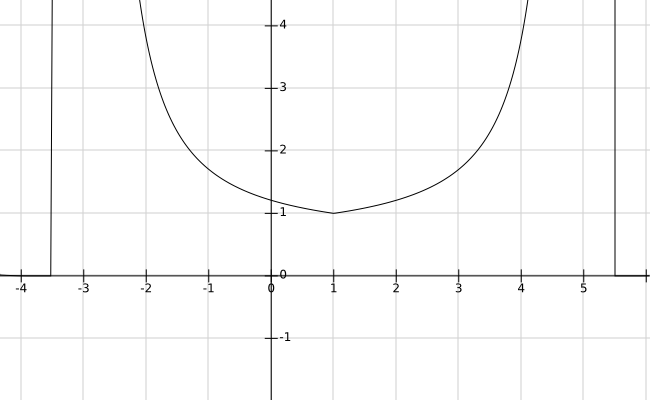

# keyboard_layout_for_mobile
### Final Goal

Find a smart phone keyboard layout for one-handed operation.

### Demands

1. Keep the finger movement distance as short as possible.
2. Consider finger length and screen size.
3. Put t and h together because of the habit of the workman keyboard layout.

### Modeling


As shown in the figure, the horizontal direction is the x-axis and the vertical direction is the y-axis. The distance between the horizontal buttons is 47, and distance between the vertical buttons is 77.(These numbers come from the input method configuration file, the unit is not important).

Distance calculation between key and key:
$$
D=\sqrt{47^2 \cdot (x_1-x_2)^2+77^2 \cdot (y_1-y_2)^2}
$$
Due to the length of the finger, the effort required to press the key in the edge area is much more than the distance from one keyboard to the other, so consider using a penalty factor associated with the position of the key.

Such as,
$$
D' = \frac{f(x_1,y_1)+f(x_2,y_2)}{2} \cdot D
$$
And make
$$
min f(x,y) = 1
$$
to preserve the original features.

Combined with the actual experience of the finger, the function used on the x-axis is
$$
f(x,y) = e^{-5(\frac{1}{|x-5.5|-7.5}+\frac{1}{7.5})}
$$
Considering that my finger is naturally pressed between e and n, and can press up to 15 horizontal buttons or 9 vertical buttons, I used the above parameters.

Specifically, move $f(x)=e^{-\frac{1}{x}}$ to the positive x direction of 13, $f(x')=f(x-13)$,

then centered at 5.5 and symmetrically transforms the right part to the left,

$f(x'')=f(|x'-5.5|+5.5)$.


in this way, the cost goes to 6 when x=0 and slightly higher than 1 (the lowest point) when x=9.

the function used on the y-axis is
$$
f(x,y) = e^{-3(\frac{1}{|y-1|-4.5}+\frac{1}{4.5})}
$$


But there were some difficulties in synthesizing the above two functions into one function.

But eventually the problem was solved by scaling the constant to the same.

The edited function is as follows:

x-axis:
$$
f(x,y) = e^{-5\left(\frac{1}{\sqrt{(x-5.5)^2}-7.5}+\frac{1}{7.5}\right)}
$$


y-axis:
$$
f(x,y)=e^{-5\left(\frac{1}{\frac{5}{3}\sqrt{(y-1)^2}-7.5}+\frac{1}{7.5}\right)}
$$
Finally got the formula
$$
f(x,y)=e^{-5\left(\frac{1}{\sqrt{(x-5.5)^2+\frac{5}{3}(y-1)^2}-7.5}+\frac{1}{7.5}\right)}
$$
Use octave to make schematics

```octave
x=-0.1:0.005:9.1;
y=-0.1:0.005:2.1;
[X,Y]=meshgrid(x,y);
Z=exp(-5*(1./(sqrt((X-5.5).^2+5/3*(Y-1).^2)-7.5)+1/7.5));
mesh(X,Y,Z)
```


### Text sample

A brief history of time, Stephen Hawking

#### Calculating

Exhaustive for the arrangement of 27 buttons, there will be $27!=1.089\times10^{28}$ possibilities. Counting the cost of an article in accordance with the determined keyboard layout itself consumes a lot of time, using python on my computer takes 0.1 seconds each time.

So I used the genetic algorithm.

The specific evolution process is

1. Randomly initialize each individual, using string encoding directly.
2. Calculate the score of each individual
3. Keep some of the best individuals as parents(default 5%)
4. The rest are selected using the tournament operator until the parents reaches the set percentage (default 20%)
5. Use crossover operators to generate new children, until the new population reaches the size of the old population
6. For these crossover-generated individuals, using mutation operators to modify their genes.

Other parameters

| population | iterations | reproduction rate | selection rate | mutation rate | contestant |
| ---------- | ---------- | ----------------- | -------------- | ------------- | ---------- |
| 5000[^2]   | 30[^3]     | 5%                | 15%            | 10%           | 5          |

### Calculation results

When using the physical distance between the buttons as the cost, the program cannot get similar results after multiple runs. But when considering the position of the button itself, the result of the program can be stabilized near `;zb..nicgkjxylaethwvqp..rof`[^1]

Only the position of the 4 keys (m, d, u, s) is not fixed, so further calculations are performed using the full arrangement and the current results are obtained.

```
; z b m d n i c g k
j x y l a e t h w v
  q p u s r o f
4343.64994823545
```

### Summary

1. Different samples may result in different results
2. The balance when using two-handed operation is temporarily not considered, so this keyboard layout may not be suitable for two-hand operation.
3. Compared to the traditional layout, the new layout changes a bit large, but it is also a good idea to sacrifice some scores, in exchange for the habitual buttons of some traditional keyboards.

### notes

[^1]: Use a semicolon as an alternative to the tab key in computing
[^2]: It is best not to be less than 2000.
[^3]: Usually, in the 22~28 generation, individuals with different genes in the population will be reduced to 10% of the population. After that the best individuals may have only minor changes.
